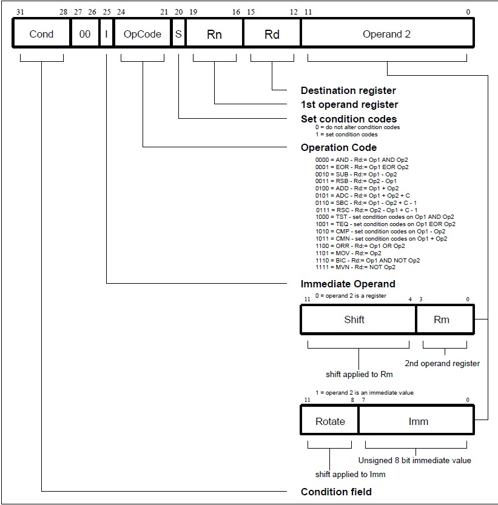
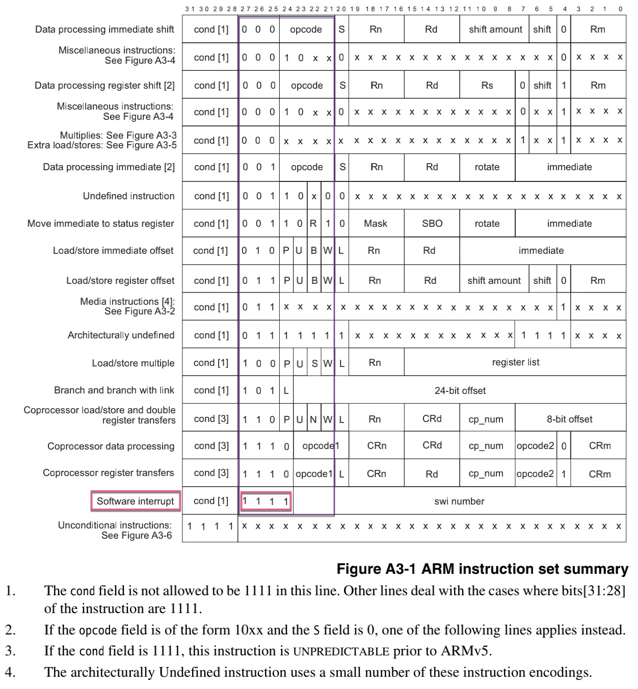
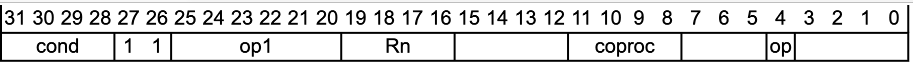
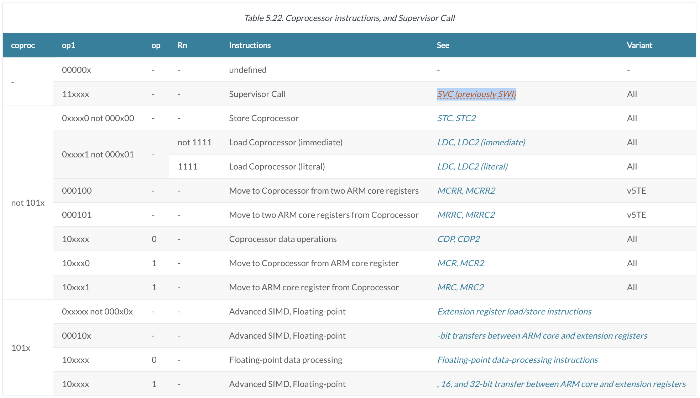
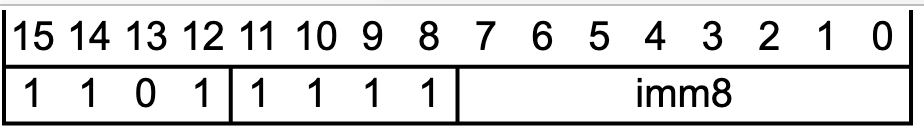
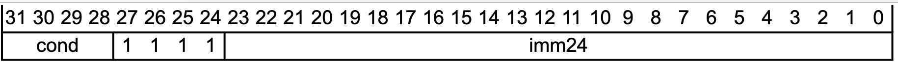

# 指令编码

ARM汇编指令编码，总体逻辑是：

## 举例说明

此处举例说明，ARM汇编指令的编码的含义和逻辑

### SVC的指令的编码

此处以 [SVC系统调用](../../arm_assembly/common_instruction/system_call.md) 为例，来解释，如何自己搞懂ARM指令的编码

对于常见的32位指令，除了`bit[28:31]`的4位是Cond=条件码之外，`bit[21:27]`就能决定了，是哪些大类的指令

而其中的：`bit[24:27]`的4个bit，是：`1111b`，则对应着就是：

* 旧：`Software Interrupt`=`SWI`=软件中断
  * =新：`SVC`=`SuperVisor Call`

以及具体细化到：

* SVC指令的具体编码
  * `SVC<c> #<imm>`
    * Thumb模式
      * 语法
        * `SVC<c> #<imm8>`
          * imm=immediate constant=立即数：8-bit=8位
      * 编码
        * 
    * ARM模式
      * 语法
        * `SVC<c> #<imm24>`
          * imm=immediate constant=立即数：24-bit=24位
      * 编码
        * 

如此，就可以从，ARM汇编指令编码的角度，搞懂每个bit的含义了。
