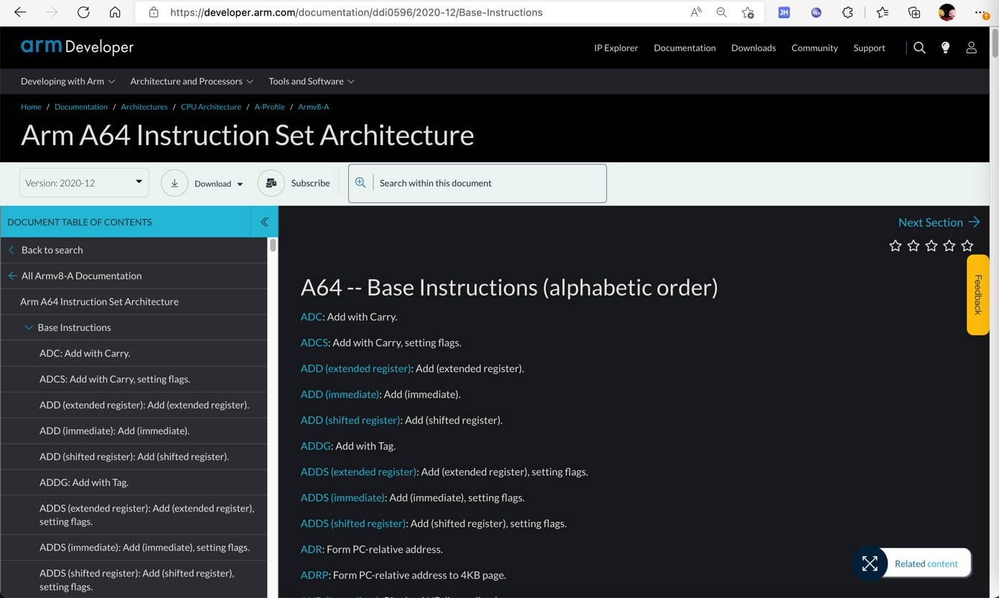
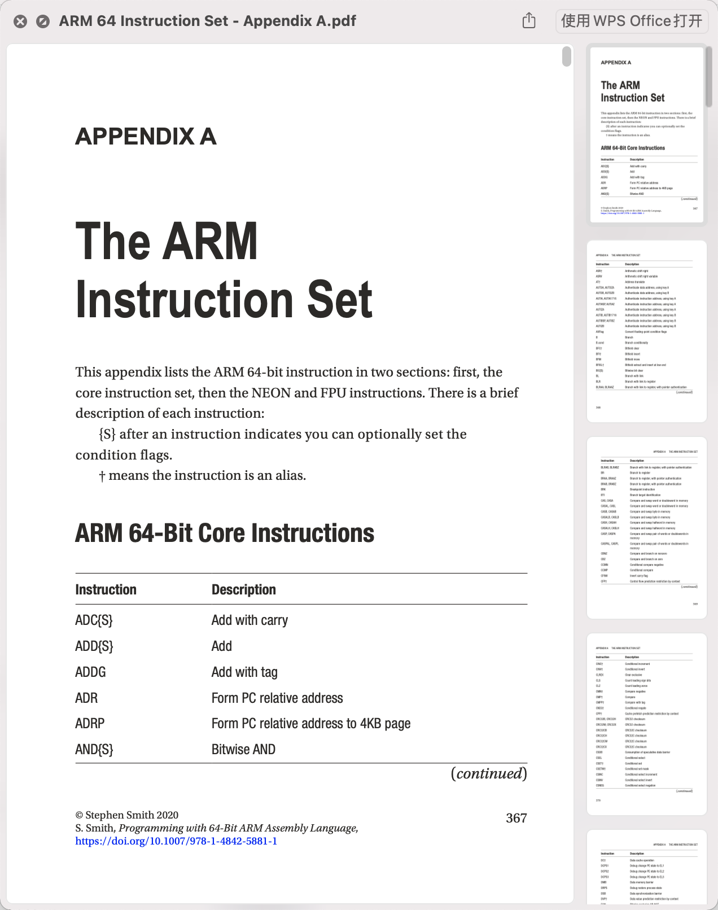

# ARM汇编指令列表

* 资料来源
  * 很全的指令的列表
    * [A Guide to ARM64 / AArch64 Assembly on Linux with Shellcodes and Cryptography | modexp (wordpress.com)](https://modexp.wordpress.com/2018/10/30/arm64-assembly/)
  * 官网的专业介绍
    * [Arm A64 Instruction Set Architecture](https://developer.arm.com/documentation/ddi0596/2020-12/Base-Instructions/BR--Branch-to-Register-)
      * 
  * ARM 64 汇编指令集
    * 包含
      * 核心指令
      * NEON和FPU指令集
    * 详见
      * https://link.springer.com/content/pdf/bbm%3A978-1-4842-5881-1%2F1.pdf
        * 
