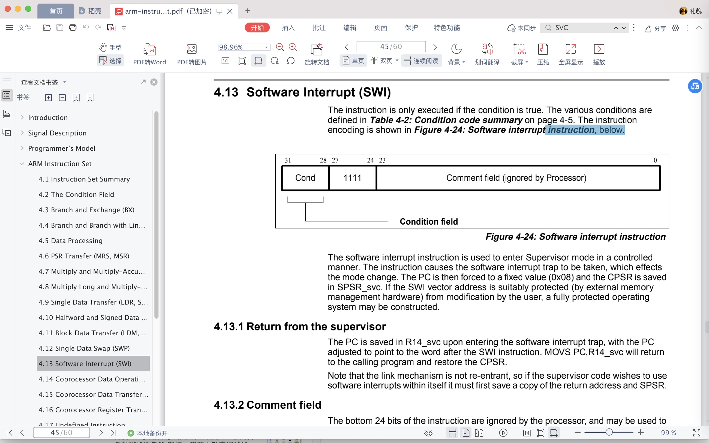
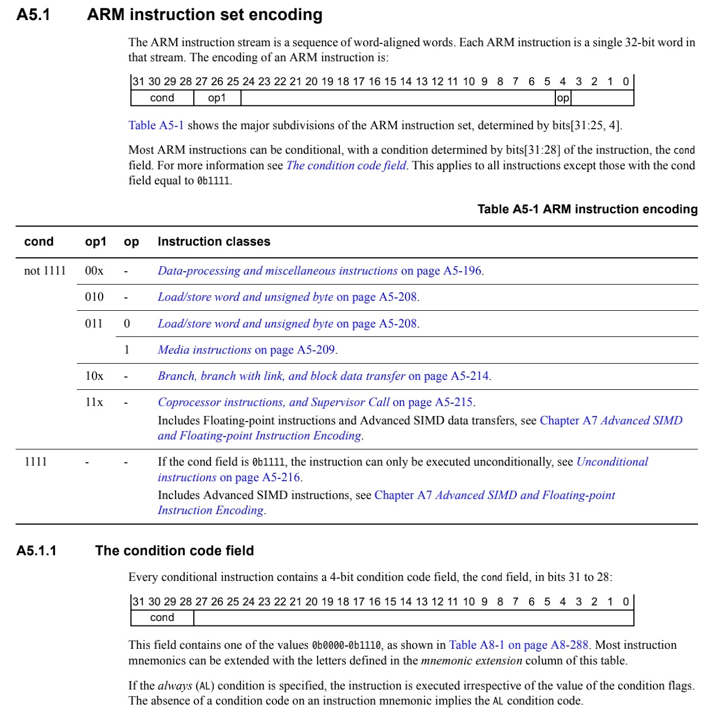
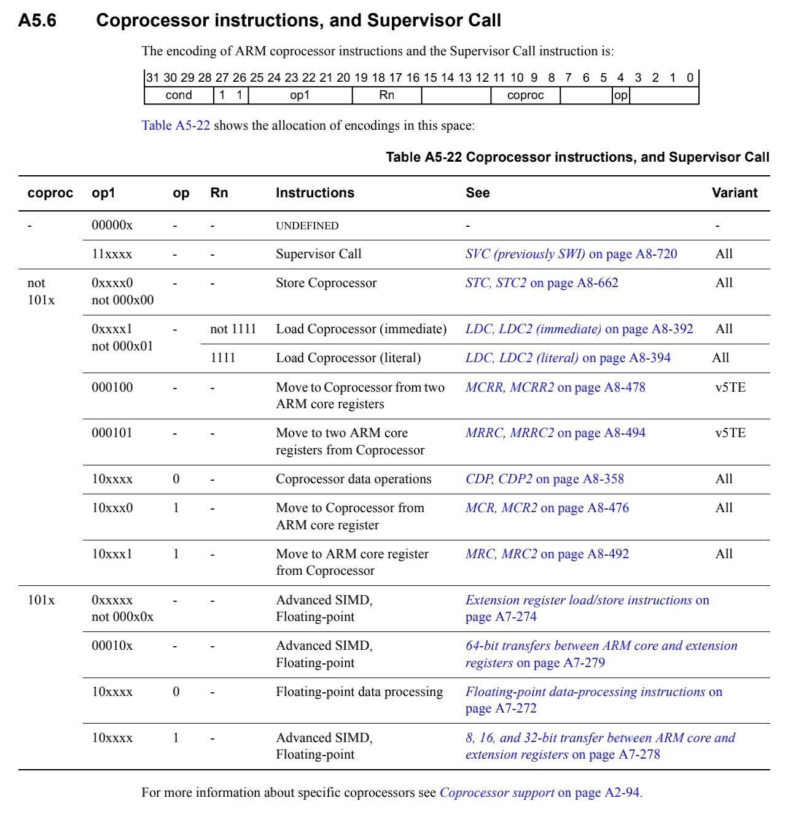
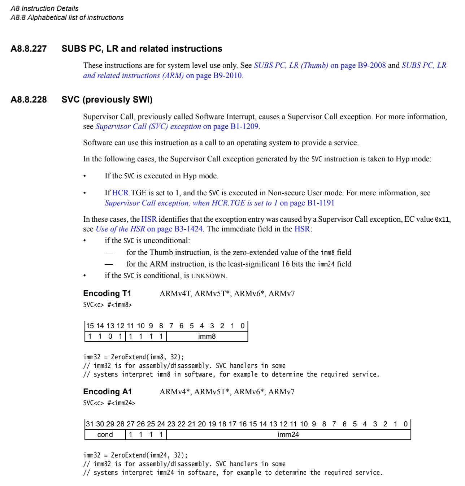
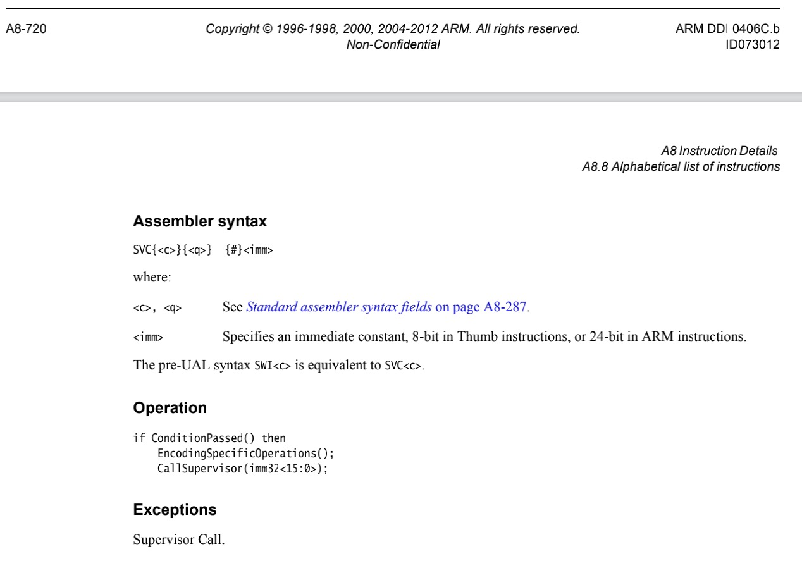
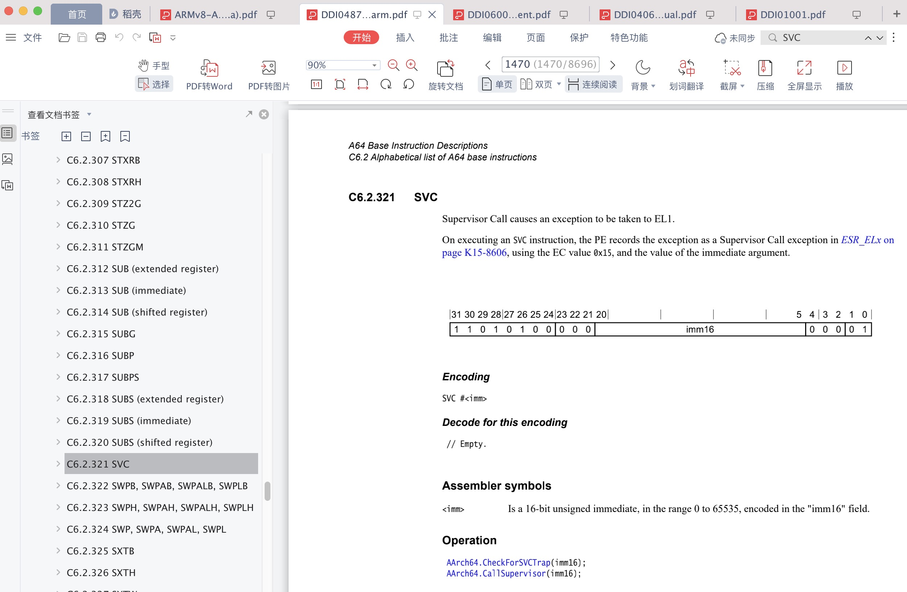

# SVC系统调用

* ARM的SVC指令
  * 名称
    * 旧：`SWI`
      * = Software Interrupt
      * = 软件中断
      * 详情
        * 
    * 新：`SVC`
      * = `SuperVisor Call`
      * = `管理程序调用`命令
  * 概述 
    * Supervisor call to allow application code to call the OS. It generates an exception targeting exception level 1 (EL1).
      * 相关EL1等细节，详见：[异常中断等级](../../../arm_common_usage/exception_level.md)
  * 语法和含义
    * `SVC #imm`
      * `SVC{cond} #imm`
    * 参数解释
      * `imm`：imm = 操作数 = 立即数 = 16bit的 = 范围：`0`~`65535`
        * This value is made available to the handler in the Exception Syndrome Register.
        * 再细分
          * 0 to 2^24-1 (a 24-bit value) in an ARM instruction
          * 0-255 (an 8-bit value) in a 16-bit Thumb instruction
  * 用法
    * The SVC instruction causes an exception. This means that the processor mode changes to Supervisor, the CPSR is saved to the Supervisor mode SPSR, and execution branches to the SVC vector
      * imm is ignored by the processor. However, it can be retrieved by the exception handler to determine what service is being requested.
  * 底层细节
    * ARM指令编码
      * 
        * bit[31-28]: cond = condition field
        * bit[27-25]: op1 = oprand 1 ?
          * op1= `11`b => `Coprocessor and Supervisor Call` == `协处理器和SVC`
    * `Coprocessor and Supervisor Call` == `协处理器和SVC`
      * 
    * SVC指令详情
      * 32位
        * 
        * 
      * 64位
        * 
