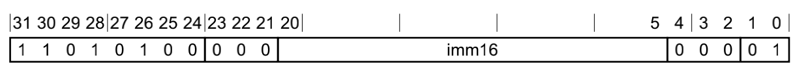

# SVC举例

## ARM64中`svc 0x80`的opcode=二进制

ARM64=AArch64中，SVC指令

* 指令格式=指令编码
  * 
* 指令语法
  * `SVC #<imm>`
    * imm=立即数
      * 16位的无符号数
      * 范围：0~65535
      * 内部对应bit位数：bit 20~5

-》所以此处的ARM汇编代码：

`SVC 0x80`

->

* imm= 0x80
  * 放到bit 20-5

加上其他固定bit位数，就是：

* bit 31-21：`1101 0100 000`
* bit 20-5：`0000 0000 1000 0000`
* bit 4-0：`000 01`

-》合并起来就是：

```bash
1101 0100 000 0000 0000 1000 0000 000 01

1101 0100 0000 0000 0001 0000 0000 0001

D4 00 10 01
```

* Little Endian
  * `01 10 00 D4`
    * `011000D4`
* Big Endian
  * `D4 00 10 01`
    * `D4001001`

-》即：

如此，才算真正搞懂：

（一般常见的默认的`Little Endian`的）ARM64=64位的ARM的`svc 0x80`的opcode=二进制，值是：`011000D4`

## svc 0 -> Perform a syscall (syscall number x16 register)

下面以`svc 0`为例，说明svc指令典型的用法和流程：

* mov x0, x1 -> x0 = x1
* movn x0, 1 -> x0 = -1
* add x0, x1 -> x0 = x0 + x1
* ldr x0, [x1] -> x0 = *x1 -> x0 = address stored in x1
* ldr x0, [x1, 0x10]! ->  x1 += 0x10; x0 = *x1(Pre-Indexing mode)
* ldr x0, [x1], 0x10 -> x0 = *x1; x1 += 0x10 (Post-Indexing mode)
* str x0, [x1] -> *x1 = x0 -> Destination is on the right
* ldr x0, [x1, 0x10] -> x0 = *(x1 + 0x10)
* ldrb w0, [x1] -> Load a byte from address stored in x1
* ldrsb w0, [x1] -> Load a signed byte from address stored in x1
* adr x0, label -> Load address of labels into x0
* stp x0, x1, [x2] ->  *x2 = x0; *(x2 + 8) = x1
* stp x29, x30, [sp, -64]! -> store x29, x30 (LR) on stack
* ldp x29, x30, [sp], 64] -> Restore x29, x30 (LR) from the stack
* svc 0 -> Perform a syscall (syscall number x16 register)
* str x0, [x29] -> store x0 at the address in x29 (destination on right)
* ldr x0, [x29] -> load the value from the address in x29 into x0
* blr x0 -> calls the subroutine at the address stored in x0, store next instruction in link register (x30)
* br x0 -> Jump to address stored in x0
* bl label -> Branch to label, store next instruction in link register (x30)
* bl printf -> Call the printf function with arguments stored x0, x1
* ret -> Jump to the address stored in x30
