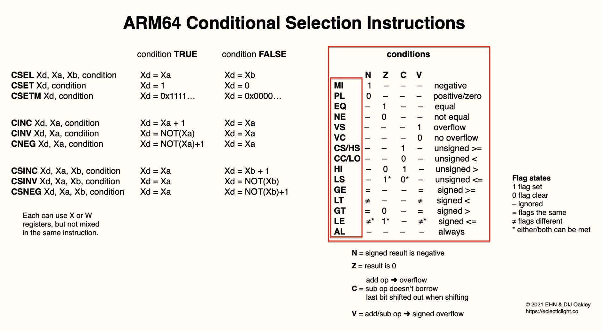
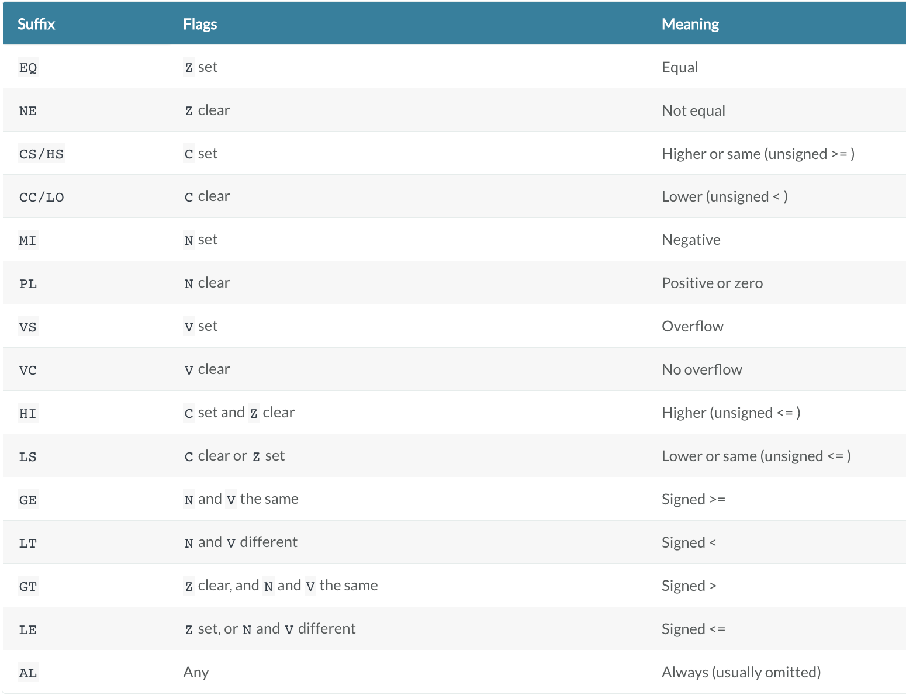
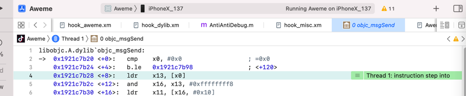
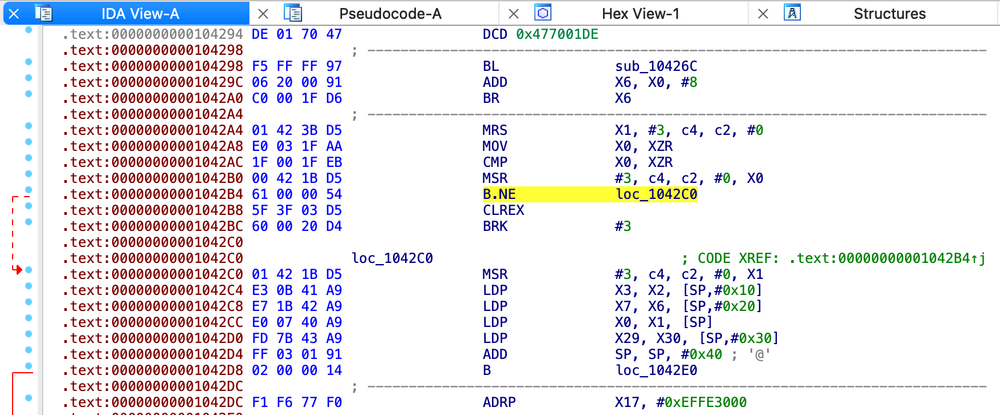

# cond条件码

* `condition`=`条件码`=`cond`=`condition code field`
  * 来源
    * ARM中，有各种`conditional selection instruction`去`Conditional execution`中的：
      * `condition`=`条件码`=缩写为：`cond`
    * 指令语法中表示为：`{cond}`
  * 如何计算出`cond`的值：
    * `NZCV`的组合值（确切的说是，`4`个`bit`中某个或某些`bit`值）决定了`cond`的值
      * `NZCV`的值
        * ARM32：`CPSR`中的`NZCV`4个bit位（的组合的值）
        * ARM64：特殊寄存器：`NZCV`
  * 具体含义逻辑
    * ARM64 Conditional Selection Instructions
      * 
    * ARM64的条件码表格
      * 

## 用法举例

### b.le

此处的指令：

```asm
libobjc.A.dylib`objc_msgSend:
    0x1921c7b20 <+0>:   cmp    x0, #0x0                  ; =0x0
->  0x1921c7b24 <+4>:   b.le   0x1921c7b98              ; <+120>
```

其中前面的指令：

```asm
0x1921c7b20 <+0>:   cmp    x0, #0x0                  ; =0x0
```

由于x0中的值是：`0x00000002820463a0`

-》已经设置了`CPSR`中的：`C`=`Carry`=`1`

然后再去运行：

```asm
b.le   0x1921c7b98
```

* `b.le` == `B指令` + `条件执行的cond是LE`

[ARM Developer Suite Assembler Guide](https://developer.arm.com/documentation/dui0068/b/ARM-Instruction-Reference/Conditional-execution)

```bash
LE
Z set, or N and V different
Signed <=
```

即：

如果之前的CPSR的条件中，满足：

`Z set, or N and V different`

即，逻辑上表示之前的判断是: `<=`，那么就跳转

而此处：

* N=0
* Z=0
* C=1
* V=0

->

* Z是0，不符合
* N和V都是0 -》 一样，不符合

所以，不跳转

所以单步运行后：



程序没有b去跳转，而是继续执行下一行指令，是符合预期的。

### B.NE的固定的间接跳转

IDA中代码：

```asm
.text:00000000001042A8 E0 03 1F AA                 MOV             X0, XZR
.text:00000000001042AC 1F 00 1F EB                 CMP             X0, XZR
.text:00000000001042B0 00 42 1B D5                 msr nzcv, x0
.text:00000000001042B4 61 00 00 54                 B.NE            loc_1042C0
```



中的`B.NE`中的`NE`

这部分代码的总体逻辑是：

* 通过XZR给X0赋值0
* 比较X0和XZR，由于都是0，所以肯定相等
* 把X0=0，写入NZCV条件码状态寄存器
* B.NE的判断逻辑是：`NE`=`Not Equal`=`不相等`，即：`Z=0`，此处的确是`Z=0`，符合条件，所以肯定会跳转到0x1042C0的代码位置

从而实现了：

固定的代码跳转逻辑：`B.NE`是100%会跳转到此处0x1042C0的位置的

-》即：一种特殊的间接跳转的实现方式
