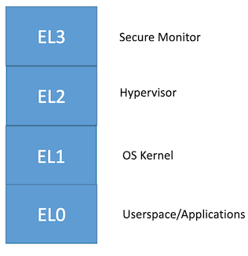
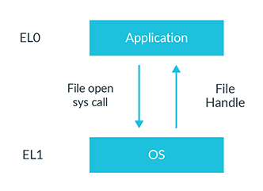

# 异常中断等级

[SVC系统调用](../arm_assembly/common_instruction/system_call.md)等指令，会涉及到：

* 跳转到异常中断 = 触发异常中断

对应的：异常（中断）等级=`Exception Level`，也有不同分类：

* 图
  * 
  * 其中：`EL0`和`EL1`之间的交互转换方式
    * 
* 文字
  * SVC - Supervisor call
    * Causes an exception targeting EL1.
    * Used by an application to call the OS.
  * HVC - Hypervisor call
    * Causes an exception targeting EL2.
    * Used by an OS to call the hypervisor, not available at EL0.
  * SMC - Secure monitor call
    * Causes an exception targeting EL3.
    * Used by an OS or hypervisor to call the EL3 firmware, not available at EL0.

