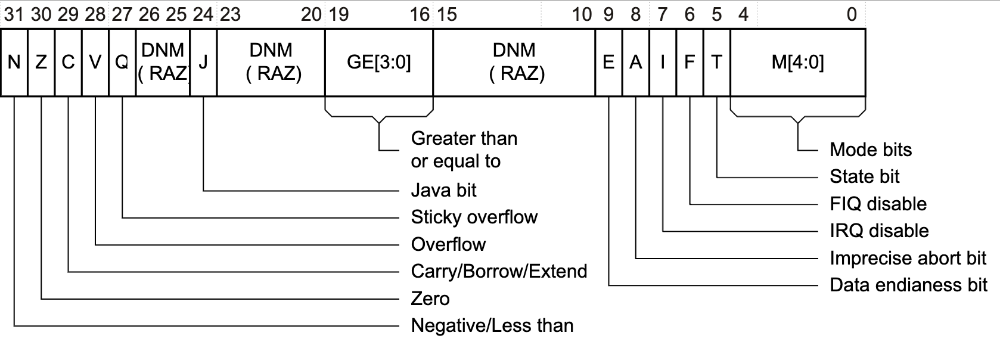

# ARM概述

* 【整理】ARM汇编指令和架构
* 【整理】ARM架构：栈Stack
* ARMv8-A has a 64-bit architecture called AArch64

---

* ARM
  * 指令集
    * ARM本身有不同的：指令集
      * ARM32：AArch32 = 32位 的 ARM的A32 和 Thumb的T32
      * ARM64：AArch64 = 64位 的 A64指令集
    * 指令集会使用到寄存器，而寄存器的使用，要符合：`调用规范`
  * 调用规范
    * 包括
      * ARM32：AAPCS
      * ARM64：AAPCS64
    * 含义
      * PCS=Procedure Call Standard
        * specifies
          * Which registers are used to pass arguments into the function.
          * Which registers are used to return a value to the function doing the calling, known as the caller.
          * Which registers the function being called, which is known as the callee, can corrupt.
          * Which registers the callee cannot corrupt.
    * 概述
      * 自己整理的：
        * 本地查看
          * 
        * 在线浏览
          * [ARM寄存器架构 | ProcessOn免费在线作图](https://www.processon.com/view/link/6295e1b80791294815547608)
      * AAPCS
        * 
      * AAPCS64 ~= AArch64
        * 
    * 详解
      * 特殊的寄存器，有专门的名称
        * `PC`=`Program Counter`=`程序计数器`
          * 用途：记录当前CPU的地址，总是指向正在“取指”的指令
            * 流水线（一般）使用三个阶段，因此指令分为三个阶段执行
              * 1、取指：从存储器装载一条指令
              * 2、译码：识别将要被执行的指令
              * 3、执行：处理 指令并将结果写回寄存器
          * 对应寄存器
            * ARM32：`R15`
            * ARM64：`X31`
        * `LR`=`Link Register`=`链接寄存器`
          * 用途：用于函数调用function calls
          * 对应寄存器
            * ARM32：`R14`
            * ARM64：`X30`
        * `SP`=`Stack Pointer`=`栈指针`
          * ARM32：`R13`
        * `FP`=`Frame Pointer`=`帧指针`
          * ARM32：R11 ？
          * ARM64：`X29`
        * `IP`==`Intra-Procedure`=`Intra-Procedure-call (scratch) register`
          * ARM32：
            * R12
          * ARM64
            * IP0 (X16) = first intra-procedure-call scratch register
            * IP1 (X17) = second intra-procedure-call temporary register
        * PR=Platform (specific) Register=平台相关寄存器
          * ARM32：R9
            * v6 = an additional callee-saved variable register
              * A virtual platform that has no need for such a special register may designate r9 as an additional callee-saved variable register, v6
            * SB=Static Base：in a position-independent data model
            * TR=Thread Register：in an environment with thread-local storage
          * ARM64：X18
        * XR=indirect result Register=间接结果寄存器
          * 用途：保存函数调用返回的（结构体等非普通的数值的）结果（的指针地址）
            * 对比：x0、x1等保存函数返回的普通的数值类型的结果，即单个寄存器能保存的值
          * 对应寄存器
            * ARM32：无？
            * ARM64：X8
      * 其他寄存器也有专门的大的分类
        * Parameter and Result Registers
          * 用途：作为参数和结果
            * 传递函数参数：调用其他（子）函数时，用x0、x1、x2等作为参数
            * 保存函数结果：函数调用返回后，结果保存在x0等寄存器中
          * 对应寄存器
            * ARM32：R0-R3
            * ARM64：X0-X7
          * 特殊
            * 一般保存返回结果，只用x0
              * 极个别情况下，才用到：x1，返回第二个函数结果
        * Caller和Callee
          * Caller-saved registers=调用者负责保存的寄存器=temporary registers=临时寄存器=Corruptible Registers=容易被破坏的寄存器
            * 用途：
              * 函数调用方 再调用 被调用函数之前 负责保存X9-X15
              * 调用子函数之前，如果这些寄存器中有保存值，记得要保存起来，即保存上下文
              * 函数调用后，再恢复这些寄存器，就恢复了现场
                * 汇编代码就可以继续运行了
            * 对应寄存器
              * ARM32：好像就没有这个说法？
              * ARM64：X9-X15
          * Callee-saved Registers=被调用者负责保存的寄存器
            * 用途
              * 被调用函数，在被调用后，刚要执行之前，负责保存X19-X29
            * 对应寄存器
              * ARM32：R4-R11
                * 除了R9特殊是PR=Platform (specific) Register
              * ARM64：X19-X28
      * 其他说明
        * 寄存器保存值的类型
          * 写成W，比如W0,、W1等：用于保存integer整数
          * 写成D，比如D0、D1等：用于保存double双精度浮点数
  * 其他相关
    * 除了上述介绍的普通寄存器之外，还有特殊寄存器
      * 状态寄存器
        * `CPSR`=`Current Program Status Register`
          * 旧称：`APSR` = `Application Program Status Register`
          * CPSR的bit位含义
            * 
        * `SPSR`=`Saved Program Status Register`
          * 注：部分模式时才可用
    * 寄存器的叫法=概念
      * Global register
        * A register whose value is neither saved nor destroyed by a subroutine. The value may be updated, but only in a manner defined by the execution environment.
      * Scratch register / temporary register
        * A register used to hold an intermediate value during a calculation (usually, such values are not named in the program source and have a limited lifetime).
      * Variable register / v-register
        * A register used to hold the value of a variable, usually one local to a routine, and often named in the source code.
    * ARM指令是三级流水线，取指，译指，执行时同时执行的
      * 现在PC指向的是正在取指的地址
        * 假设在ARM状态 下，一个指令占4个字节
          * 那么
            * cpu正在译指的指令地址是PC-4
            * cpu正在执行的指令地址是PC-8
            * 下一个指令的值就是：PC+4
      * -》也就是说PC所指向的地址和现在所执行的指令地址相差8
        * 当突然发生中断的时候，保存的是PC的地址
        * 如果返回的时候返回PC，那么中间就有一个指令没有执行，所以用 
          * SUB pc lr-irq #4
    * 函数调用 相关
      * caller和callee
        * 
      * Example stack frame layout
        * 
      * The va_list
        * 
      * LR寄存器 用法 图示
        * 
    * 相关名字概念
      * prologue vs epilogue
        * prologue code = start of routine = 开场代码
          * 被调用函数的最开始一段代码要做的事情
        * epilogue code = 结尾代码
          * 被调用函数的最后一段代码要做的事情
      * caller-safe register vs callee-safe register
        * caller-safe register
          * caller负责保存的寄存器
            * 比如当r12用作scratch register时，calle被调用函数内，有可能会使用r12，改变r12的值，则此时caller函数调用者就要在调用calle之前，自己保存好r12的值
              * -》Scratch register 也叫做caller-safe register
        * callee-safe register
          * calle负责保存的寄存器
