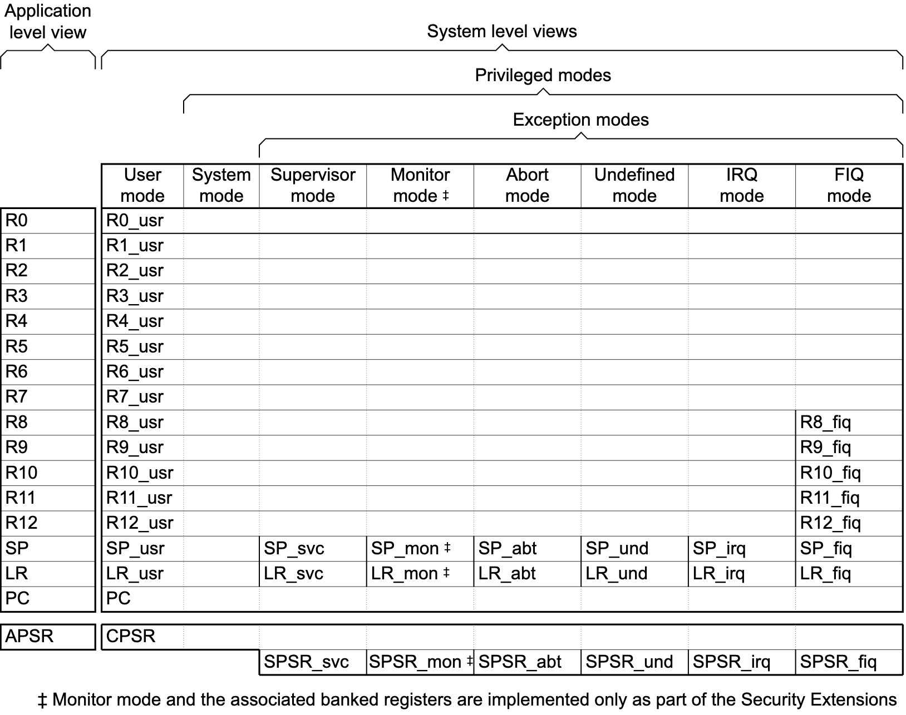
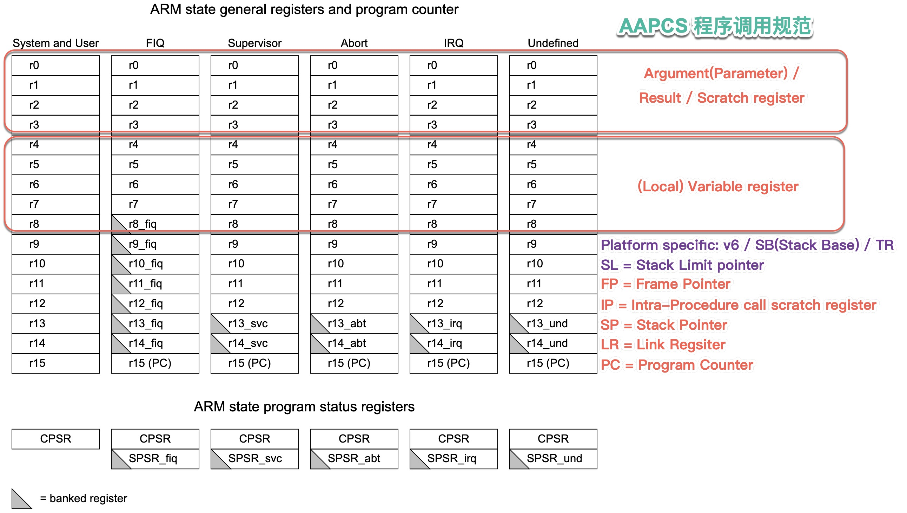
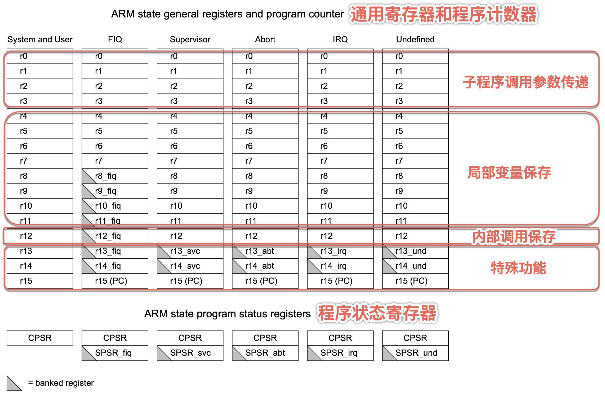
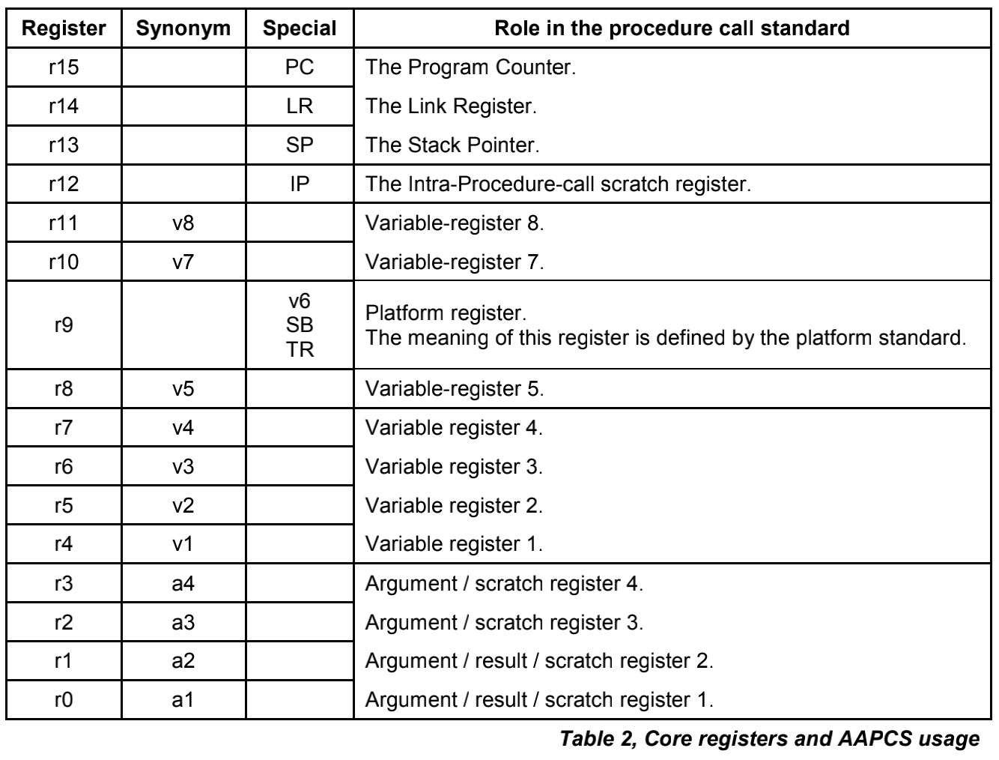
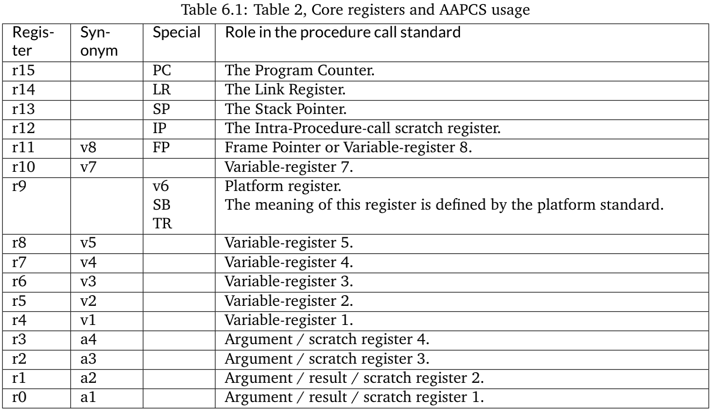
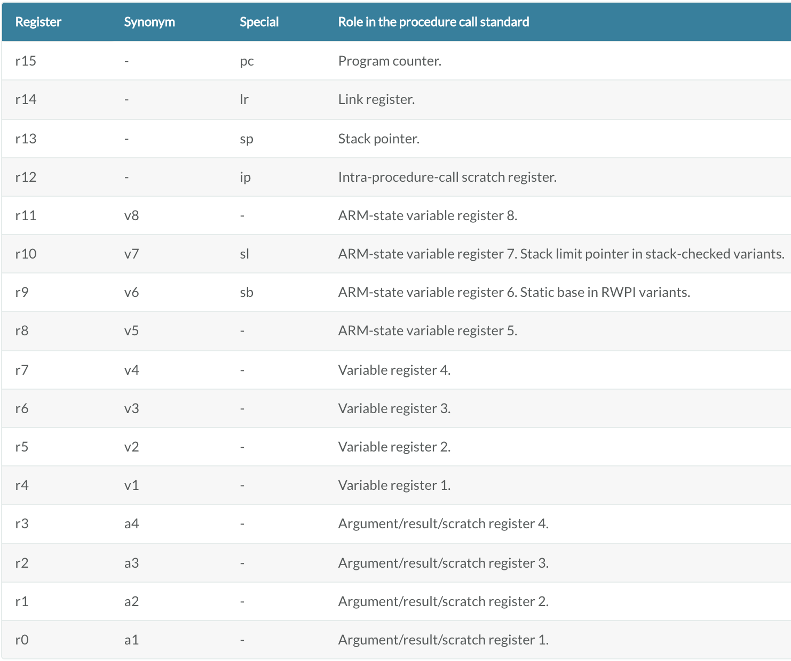

# 调用规范

* 【已解决】ARM的ARM64汇编语法和寄存器、调用规范等基础知识
* 【已解决】ARM64中寄存器用法规范
* 【整理】ARM程序调用规范AAPCS：举例解释
* 【已解决】IDA中xsp和xbp是什么意思如何定位地址

---

## 背景知识
* ARM模式和寄存器
  * ARM处理器有7种（运行）模式
    * usr = User = 用户模式
    * fiq = Fast interrupt = 快速中断模式
    * irq= Interrupt = 普通中断模式
    * svc = Supervisor = 管理模式
    * abt = Abort = 数据访问中止模式
    * usr = System = 系统模式
      * User用户模式和System系统模式共用一套寄存器
    * und = Undefined = 未定义指令中止模式
  * 概述
    * Organization of general-purpose registers and Program Status Registers
      * 

## AAPCS(Procedure Call Standard for the Arm Architecture) 程序调用规范 = ARM寄存器用法 用途

* `AAPCS`=`Procedure Call Standard for the Arm Architecture`=`程序调用规范`
  * 含义：描述了ARM寄存器用途和用法
  * 图=概述
    * ARM状态的寄存器组织结构 + 寄存器用法
      * 
      * 
    * 核心寄存器和AAPCS用法
      * 
        * r9：平台寄存器: v6 / SB /TR
        * r11 = SP
        * r12 = IP
      * 
      * 
    * 从不同版本可以看出
      * 一般来说，函数返回值只用r0-r1
        * 偶尔也可以用r2-r3
  * 文字
    * [ARM Developer Suite Developer Guide](https://developer.arm.com/documentation/dui0056/d/using-the-procedure-call-standard/register-roles-and-names/register-roles) 的 ATPCS
      * r0-r3 
        * Use registers r0-r3 to pass parameter values into routines, and to pass result values out. You can refer to r0-r3 as a1-a4 to make this usage apparent. See Parameter passing. Between subroutine calls you can use r0-r3 for any purpose. A called routine does not have to restore r0-r3 before returning. A calling routine must preserve the contents of r0-r3 if it needs them again.
      * r4-r11
        * Use registers r4-r11 to hold the values of a routine's local variables. You can refer to them as v1-v8 to make this usage apparent. In Thumb state, in most instructions you can only use registers r4-r7 for local variables. A called routine must restore the values of these registers before returning, if it has used them.
      * r12
        * Register r12 is the intra-call scratch register, ip. It is used in this role in procedure linkage veneers, for example interworking veneers. Between procedure calls you can use it for any purpose. A called routine does not need to restore r12 before returning.
      * r13
        * Register r13 is the stack pointer, sp. You must not use it for any other purpose. The value held in sp on exit from a called routine must be the same as it was on entry.
      * r14
        * Register r14 is the link register, lr. If you save the return address, you can use r14 for other purposes between calls.
      * r15
        * Register r15 is the program counter, pc. It cannot be used for any other purpose.
    * [Procedure Call Standard for the Arm Architecture - ABI 2020Q2 documentation](https://developer.arm.com/documentation/ihi0042/latest?_ga=2.215629013.39337456.1594418816-1019531699.1594418816)
      * r0-r3
        * The first four registers r0-r3 (a1-a4) are used to pass argument values into a subroutine and to return a result value from a function. They may also be used to hold intermediate values within a routine (but, in general, only between subroutine calls).
      * r12
        * Register r12 (IP) may be used by a linker as a scratch register between a routine and any subroutine it calls (for details, see Use of IP by the linker). It can also be used within a routine to hold intermediate values between subroutine calls.
      * r11
        * In some variants r11 (FP) may be used as a frame pointer in order to chain frame activation records into a linked list.
      * r9
        * The role of register r9 is platform specific. A virtual platform may assign any role to this register and must document this usage. For example, it may designate it as the static base (SB) in a position-independent data model, or it may designate it as the thread register (TR) in an environment with thread-local storage. The usage of this register may require that the value held is persistent across all calls. A virtual platform that has no need for such a special register may designate r9 as an additional callee-saved variable register, v6.
      * r4-r8, r10, r11
        * Typically, the registers r4-r8, r10 and r11 (v1-v5, v7 and v8) are used to hold the values of a routine's local variables. Of these, only v1-v4 can be used uniformly by the whole Thumb instruction set, but the AAPCS does not require that Thumb code only use those registers.
        * A subroutine must preserve the contents of the registers r4-r8, r10, r11 and SP (and r9 in PCS variants that designate r9 as v6).
      * r12-r15
        * In all variants of the procedure call standard, registers r12-r15 have special roles. In these roles they are labeled IP, SP, LR and PC.
  * 相关资料
    * github.com
      * [ARM-software/abi-aa: Application Binary Interface for the Arm® Architecture (github.com)](https://github.com/ARM-software/abi-aa)
        * aapcs32
          * [abi-aa/aapcs32.rst at main · ARM-software/abi-aa (github.com)](https://github.com/ARM-software/abi-aa/blob/main/aapcs32/aapcs32.rst)
        * aapcs64
          * [abi-aa/aapcs64.rst at main · ARM-software/abi-aa (github.com)](https://github.com/ARM-software/abi-aa/blob/main/aapcs64/aapcs64.rst)
        * [Releases · ARM-software/abi-aa (github.com)](https://github.com/ARM-software/abi-aa/releases)
            * ARM64
              * ABI for the Arm 64-bit Architecture
                * Procedure Call Standard for the Arm 64-bit Architecture
                  * pdf
                    * https://github.com/ARM-software/abi-aa/releases/download/2021Q1/aapcs64.pdf
                  * html
                    * https://github.com/ARM-software/abi-aa/blob/2bcab1e3b22d55170c563c3c7940134089176746/aapcs64/aapcs64.rst
    * arm.com
      * 和软件开发相关资料的入口
        * [Develop Software – Arm Developer](https://developer.arm.com/develop-software)
      * 各种软件资料
        * [System Architectures | Application Binary Interface (ABI) – Arm Developer](https://developer.arm.com/architectures/system-architectures/software-standards/abi)
          * [Procedure Call Standard for the Arm 64-bit Architecture](https://developer.arm.com/documentation/ihi0055/latest)
