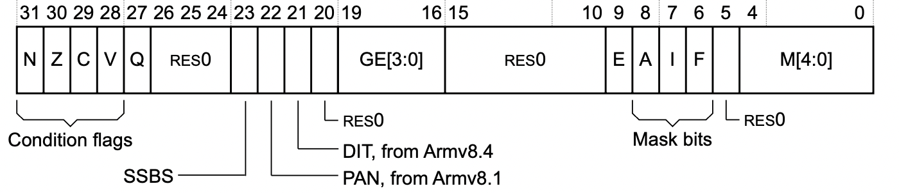
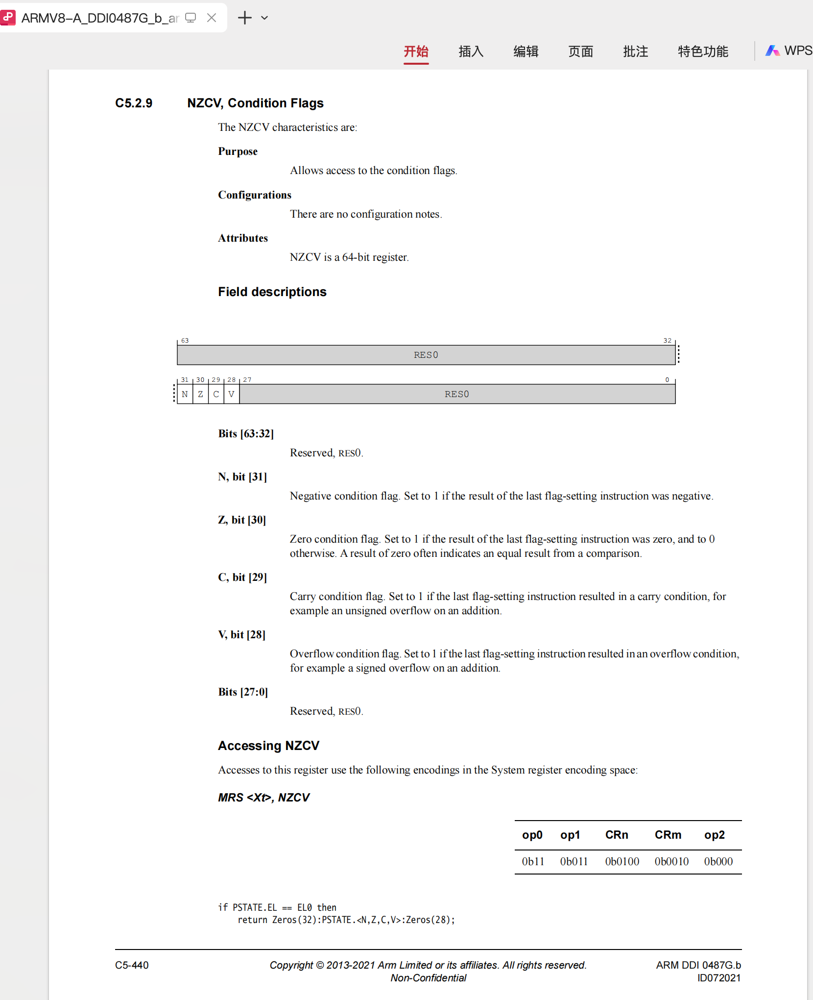
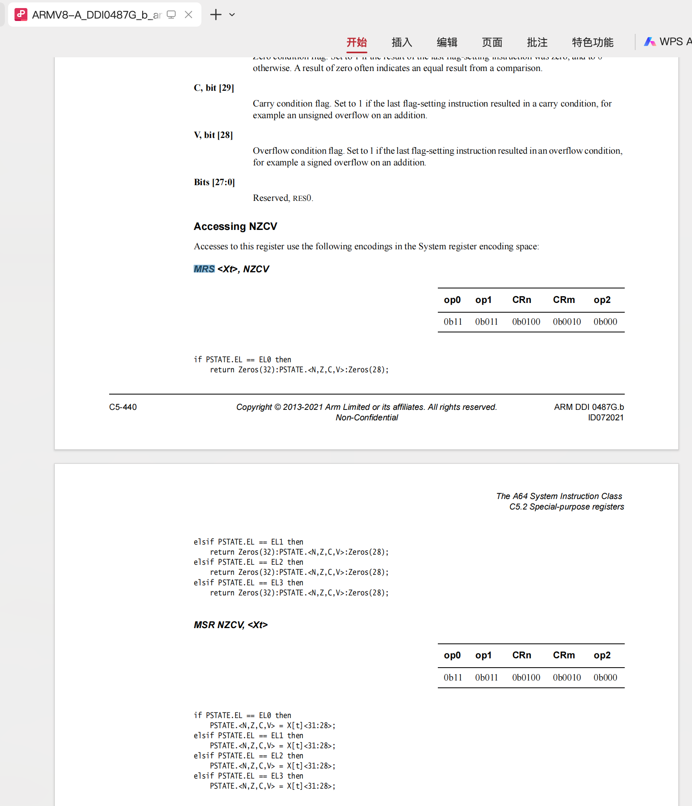

# NZCV

* `NZCV`
  * 含义
    * `N`=`Negative` Condition flag=`借位标志`
    * `Z`=`Zero` Condition flag=`0`
    * `C`=`Carry` Condition flag=进位标志
    * `V`=`Overflow` Condition flag=溢出标志
  * ARM32
    * 是`CPSR`状态寄存器保存了`NZCV`的值
      * 
  * ARM64
    * 具体表示和写法
      * 要表示`PSTATE`中的某一标志，比如`进位`，可以写成`PSTATE.C`
    * 读取和写入，用特殊的指令
      * `MSR`
        ```bash
        MSR NZCV, <Xt>
        ```
      * `MRS`
        ```bash
        MRS <Xt>, NZCV
        ```
    * ARM手册
      * 
      * 
