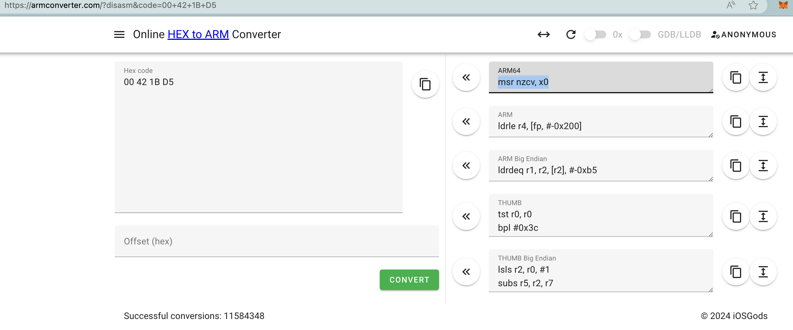
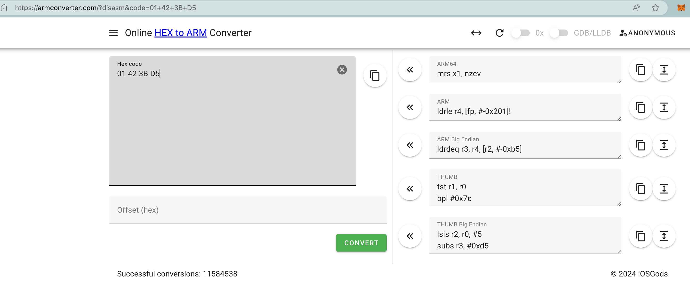

# 指令和二进制opcode互转

* ARM 指令 在线 生成 转换
  * [Online ARM to HEX Converter (armconverter.com)](https://armconverter.com)
    * `00 42 1B D5` -> ARM64的: `msr nzcv, x0`
      * 
    * `01 42 3B D5` -> ARM64的: `mrs x1, nzcv`
      * 
