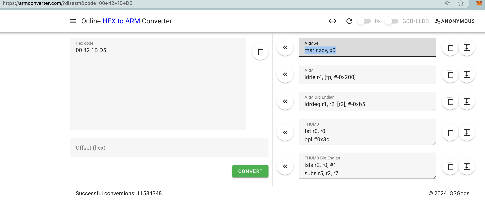
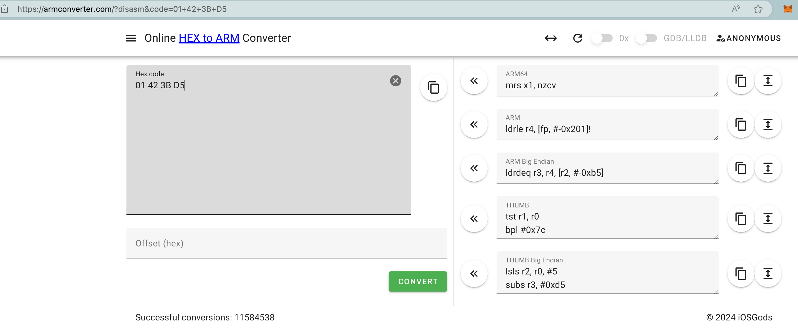
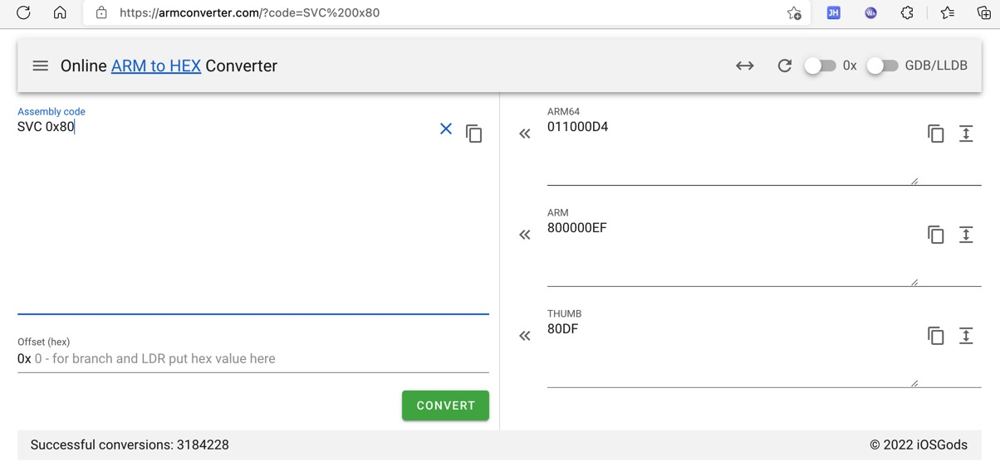
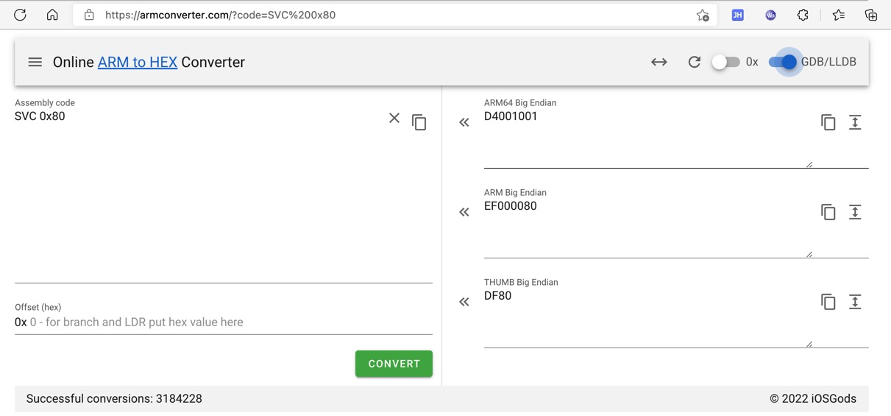

# 指令和二进制opcode互转

* ARM 指令 在线 生成 转换
  * [Online ARM to HEX Converter (armconverter.com)](https://armconverter.com)
    * 举例
      * binary二进制=opcode操作码 => ARM指令
        * `00 42 1B D5` -> ARM64的: `msr nzcv, x0`
          * 
      * `01 42 3B D5` -> ARM64的: `mrs x1, nzcv`
        * 
      * ARM指令 => binary二进制=opcode操作码
        * `SVC 0x80`
          * 默认：`LittleEndian`
            * 
              * Assembly code
                * `SVC 0x80`
              * Binary
                * ARM64
                  * `011000D4`
                    * `01 10 00 D4`
                * ARM
                  * `800000EF`
                * Thumb
                  * `80DF`
          * 勾选GDB/LLDB后：`BigEndian`
            * 
              * Assembly code
                * `SVC 0x80`
              * Binary
                * ARM64
                  * `D4001001`
                * ARM
                  * `EF000080`
                * Thumb
                  * `DF80`
